# PoseBaby 📸

> 您的 AI 摄影教练 - 由大语言模型驱动的专业摆姿指导

<p align="center">
  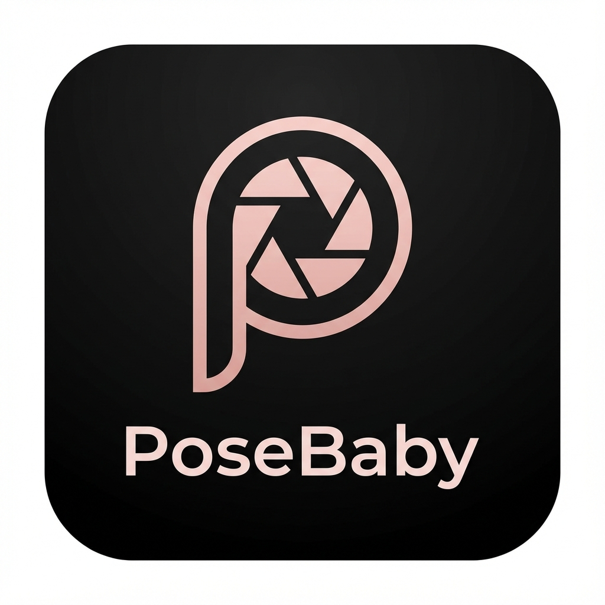
</p>

<p align="center">
  <a href="#功能特性">功能特性</a> •
  <a href="#演示">演示</a> •
  <a href="#架构设计">架构设计</a> •
  <a href="#技术栈">技术栈</a> •
  <a href="#快速入门">快速入门</a>
</p>

---

## 🎯 痛点分析

作为一名男士，遇到优美风景给女朋友拍照时，我总是很难给出有效的摆姿指导。我不是专业摄影师，所以我经常在想：

> *"如果有一个 AI 能像专业摄影师一样站在我身边，教我如何拍摄，那该多好？"*

我搜索了现有的解决方案，但没有发现能真正满足这个需求的应用。于是，我决定自己做一个。

**PoseBaby** 是一款 AI 驱动的摄影助手。它能分析你的拍摄场景，并提供实时的摆姿建议——就像有一位专业摄影师在每一个镜头前为你提供指导。

## ✨ 功能特性

### 🖼️ 图片模式 (Image Mode)
- **场景分析**：AI 分析照片的光线、背景和氛围。
- **摆姿建议**：获得 4 个契合场景的创意摆姿想法。
- **参考图生成**：使用豆包 AI 生成专业的参考图片。
- **网格布局**：支持 1×1、1×2、2×2 或 3×3 的网格布局。
- **道具支持**：添加摄影道具（花卉、书籍、雨伞等）。
- **分割查看器**：查看并从生成的网格中选择单个姿势。
- **实时拍照**：直接从叠加层界面采集照片。

### 📝 文本模式 (Text Mode)
- **骨骼叠加**：实时的姿势骨骼引导。
- **捏合缩放**：调节骨骼参考线的大小。
- **姿势匹配**：使用 ML Kit 实现姿势检测与对齐。

## 🎬 演示

<video src="demo/demo.mp4" controls="controls" style="max-width: 100%;"></video>

### 📸 应用截图

<p align="center">
  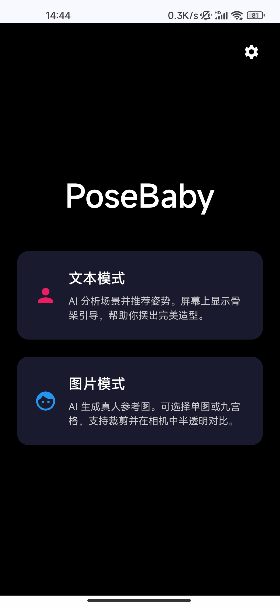
  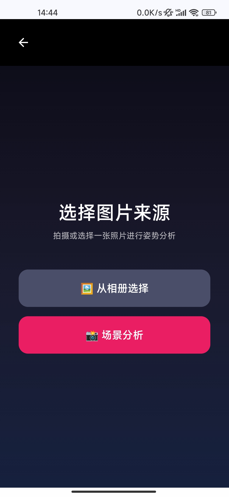
  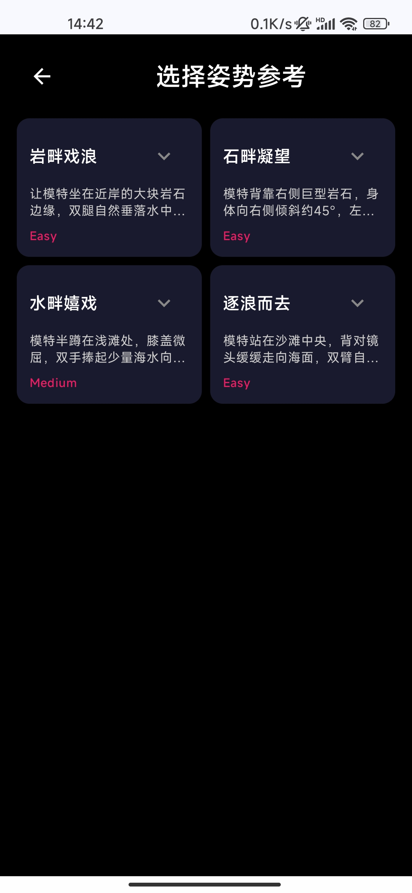
  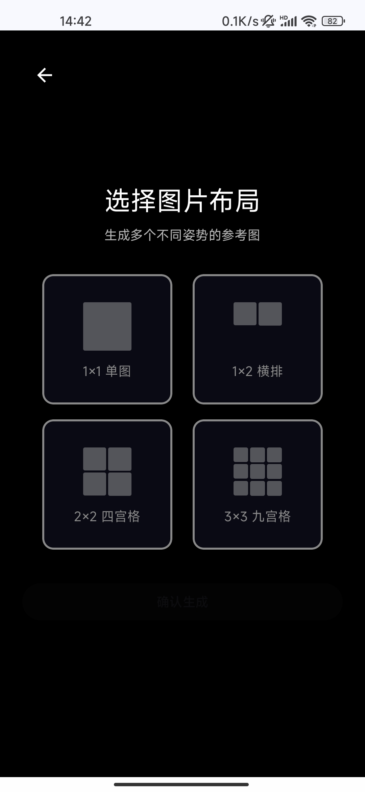
  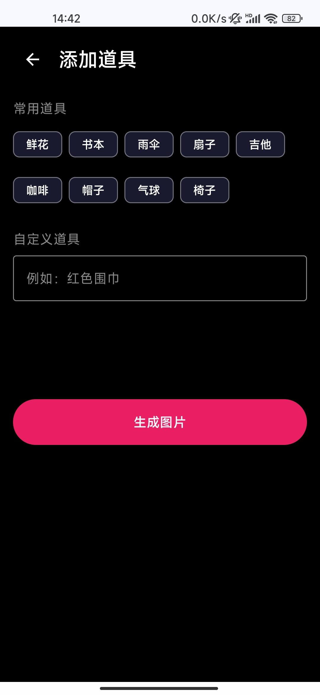
</p>
<p align="center">
  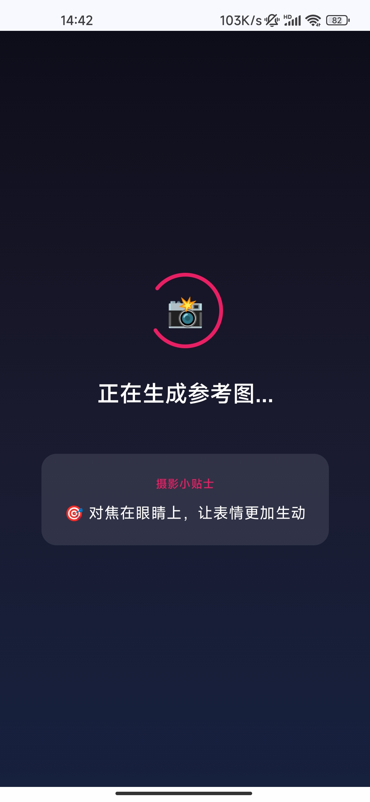
  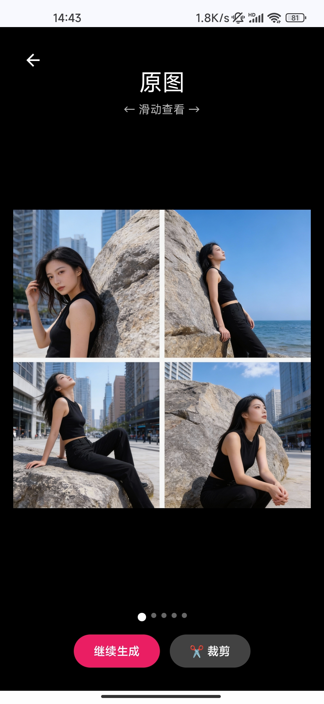
  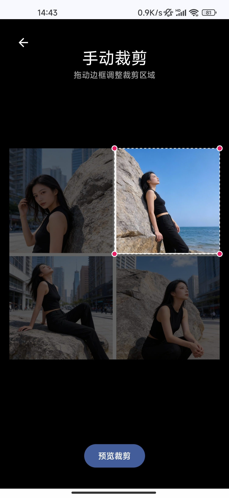
  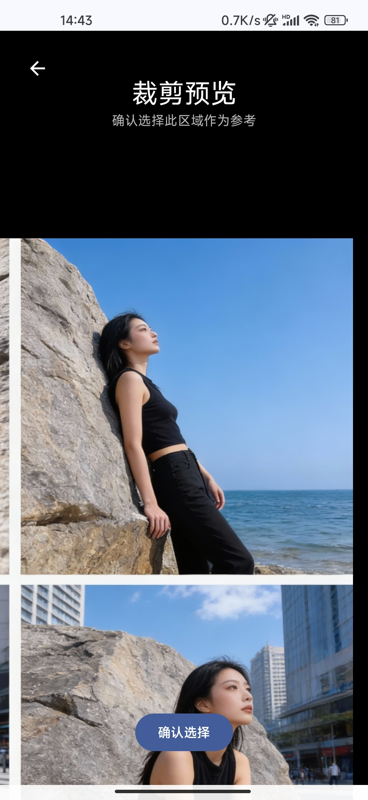
  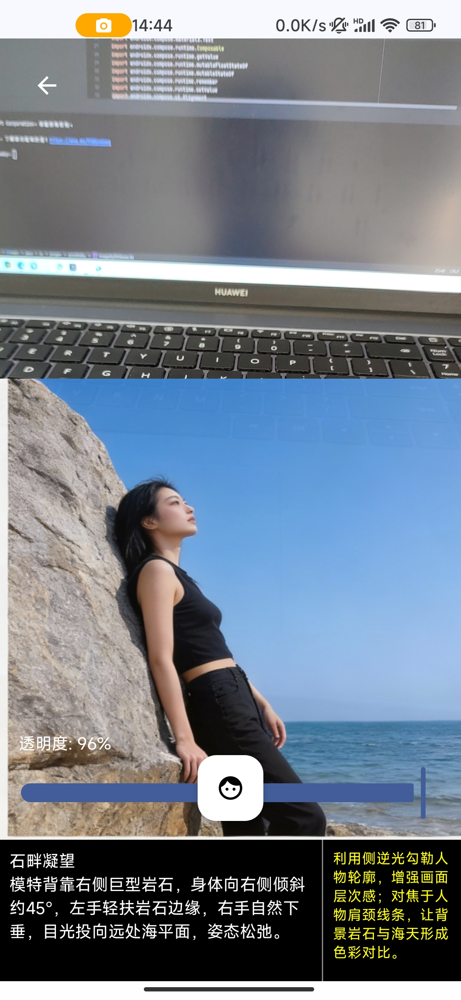
</p>

## 🏗️ 架构设计

```
┌─────────────────────────────────────────────────────────────┐
│                         UI 层                               │
│  ┌─────────────┐  ┌─────────────┐  ┌─────────────────────┐  │
│  │ MainActivity │  │ Composables │  │      叠加层界面     │  │
│  └──────┬──────┘  └──────┬──────┘  └──────────┬──────────┘  │
│         │                │                     │             │
│         └────────────────┼─────────────────────┘             │
│                          ▼                                   │
│  ┌───────────────────────────────────────────────────────┐  │
│  │                   MainViewModel                        │  │
│  │    • 状态管理 (AppState 枚举)                          │  │
│  │    • 流程调度                                          │  │
│  │    • 提示词组装                                        │  │
│  └────────────────────────┬──────────────────────────────┘  │
│                           │                                  │
├───────────────────────────┼──────────────────────────────────┤
│                         数据层                              │
│  ┌──────────────┐  ┌──────────────┐  ┌──────────────────┐   │
│  │ ZRepository  │  │DoubaoRepo    │  │ ZhipuRepository  │   │
│  │ (场景 AI)    │  │(图像生)      │  │ (备用仓库)       │   │
│  └──────┬───────┘  └──────┬───────┘  └────────┬─────────┘   │
│         │                 │                    │             │
│         ▼                 ▼                    ▼             │
│  ┌─────────────────────────────────────────────────────────┐│
│  │                    外部 API                              ││
│  │   • 智谱 AI (GLM-4.5v) - 场景分析                        ││
│  │   • 豆包 (火山引擎) - 图像生成                           ││
│  └─────────────────────────────────────────────────────────┘│
│                                                              │
│  ┌─────────────────────────────────────────────────────────┐│
│  │                    ML Kit                                ││
│  │   • 姿态检测 - 骨骼叠加                                  ││
│  └─────────────────────────────────────────────────────────┘│
└──────────────────────────────────────────────────────────────┘
```

### 应用流程

```
模式选择 → 来源选择 → 相机/相册
       │
       ▼
   场景分析 (AI)
       │
       ▼
  姿势选择 (4 个建议)
       │
       ├── 文本模式 ──→ 骨骼叠加 ──→ 拍照采集
       │
       └── 图片模式 ──→ 网格选择 ──→ 道具选择
                                │
                                ▼
                         图像生成 (豆包)
                                │
                                ▼
                         分割查看器 (选择姿势)
                                │
                                ▼
                         参考图叠加 ──→ 拍照采集
```

## 🛠️ 技术栈

| 类别 | 技术 |
|----------|------------|
| **开发语言** | Kotlin |
| **UI 框架** | Jetpack Compose |
| **架构模式** | MVVM (配合 StateFlow) |
| **相机框架** | CameraX |
| **机器学习** | Google ML Kit (Pose Detection) |
| **网络请求** | OkHttp |
| **图片加载** | Coil |
| **AI - 场景分析** | 智谱 AI (GLM-4.5v) |
| **AI - 图像生成** | 豆包 (火山引擎) |
| **最低支持 SDK** | 24 (Android 7.0) |
| **编译目标 SDK** | 35 |

## 🚀 快速入门

### 环境需求

- Android Studio Hedgehog (2023.1.1) 或更高版本
- JDK 11+
- Android 7.0+ (API 24+) 的真机或模拟器

### API 密钥配置

本应用需要以下平台的 API 密钥：
1. **智谱 AI** (BigModel) - 用于场景分析
2. **豆包** (火山引擎) - 用于参考图生成

### 安装步骤

1. **克隆仓库**
   ```bash
   git clone https://github.com/jorgen-zhao/posebaby.git
   cd posebaby
   ```

2. **配置密钥**
   
   在项目根目录下创建或编辑 `local.properties` 文件：
   ```properties
   # Android SDK 路径 (通常由 IDE 自动生成)
   sdk.dir=/path/to/android/sdk
   
   # API 密钥 (必填)
   ZHIPU_API_KEY=您的智谱AI密钥
   DOUBAO_API_KEY=您的豆包API密钥
   ```

3. **构建与运行**
   ```bash
   ./gradlew assembleDebug
   ```
   或者直接在 Android Studio 中点击运行按钮。

### 获取 API 密钥

- **智谱 AI**：在 [open.bigmodel.cn](https://open.bigmodel.cn/) 注册申请。
- **豆包**：在 [volcengine.com](https://www.volcengine.com/) 注册申请。

## 📄 开源协议

```
Copyright 2025 Jorgen Zhao

Licensed under the Apache License, Version 2.0 (the "License");
you may not use this file except in compliance with the License.
You may obtain a copy of the License at

    http://www.apache.org/licenses/LICENSE-2.0

Unless required by applicable law or agreed to in writing, software
distributed under the License is distributed on an "AS IS" BASIS,
WITHOUT WARRANTIES OR CONDITIONS OF ANY KIND, either express or implied.
See the License for the specific language governing permissions and
limitations under the License.
```

---

<p align="center">
  Made with ❤️ by <a href="https://github.com/jorgen-zhao">Jorgen Zhao</a>
</p>
